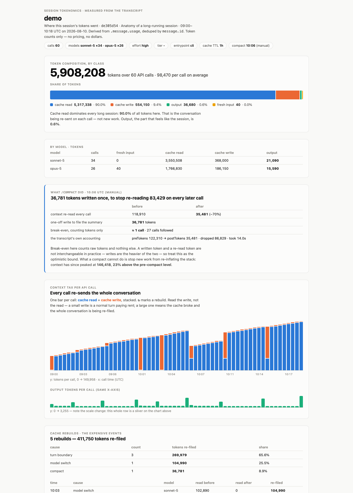
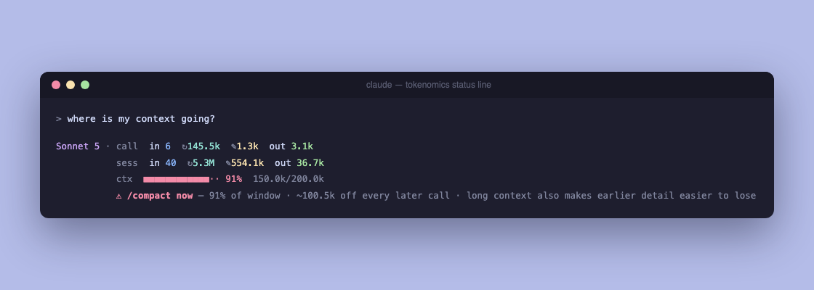

# tokenomics — Claude Code

A Claude Code plugin that measures where a session's **tokens and context** actually go.

Not a billing tool — it reports token counts and never asserts a price. On a subscription,
tokens spend your rate-limit headroom; on an API key they are metered. The mechanism is
identical either way, and what a token is *worth* gets its own treatment at the top of
[docs/tokenomics-explained.md](docs/tokenomics-explained.md).

The model has no memory, so every API call re-sends the entire conversation; caching makes
that survivable, and nearly everything interesting about a long session is about **when the
cache gets rewritten** — a model switch, an idle gap, a `/compact`, or you sending a
message. This plugin makes those events visible in your own sessions.



## What it gives you

| Surface | What it does |
|---|---|
| `/tokenomics` | measure a session, summarise it, or render an HTML report |
| `/tokenomics:statusline` | check or set up the status line |
| status line | live per-call and per-session token counts, plus a compact nudge — **terminal only** |
| compact nudge | a `Stop` hook that speaks once per 150k of context, escalating — works everywhere, including desktop |
| skill | Claude reaches for the mental model on its own when you ask why a session feels heavy |

## Install

From your terminal:

```bash
claude plugin marketplace add Priyadarshiswain/tokenomics
claude plugin install tokenomics@tokenomics
```

Or, inside a Claude Code session, the same thing as slash commands:

```
/plugin marketplace add Priyadarshiswain/tokenomics
/plugin install tokenomics@tokenomics
```

Or just ask Claude Code, in a sentence: *"install the tokenomics plugin from
github.com/Priyadarshiswain/tokenomics"* — it runs the two commands above for you.

To try it without installing anything, clone this repo and load it for one session
(run this from the repository root):

```bash
claude --plugin-dir .
```

That registers no marketplace and nothing to uninstall — the plugin is unloaded when the
session ends. It is not quite traceless, and this plugin is the wrong one to pretend
otherwise: the compact nudge keeps its ladder state in a plugin data directory, which
Claude Code creates at `~/.claude/plugins/data/tokenomics-inline/` and never reclaims,
because there is no installed plugin for `claude plugin uninstall` to clean up after. If
you measure a session, that writes a report bundle too. Both are listed under
**Uninstall**. The status line is the one feature this does not cover, since it is a user
setting rather than a plugin one.

Requires **`python3`**. The three components — measure tool, status line, hook — are pure
Python, and `jq` is not needed anywhere; the port removed the dependency that was hardest
to satisfy on Windows. Two small bash pieces remain: `bin/tokenomics`, the shim that makes
the tool a bare command on the Bash tool's PATH, and `tests/run.sh`, the test harness.
The local dashboard binds to localhost only. Developed and tested on macOS and Linux;
**Windows is untested** — see the note under the compact nudge.

Once installed, `tokenomics` is on the Bash tool's `PATH` inside a Claude Code session, so
Claude can run `tokenomics --json` without knowing where the plugin lives. From your own
terminal, call the script by path (see below).

## The status line

**Terminal only.** The status line renders in the Claude Code CLI. It does not appear in the
desktop app — the setting applies and the script runs, but there is no surface to draw it on.
Measured, not assumed: identical settings render in a terminal and show nothing in desktop.
Desktop users get the same numbers on demand from `/tokenomics`.

`statusLine` is also a user setting that a plugin cannot ship — plugin `settings.json`
currently honours only the `agent` and `subagentStatusLine` keys — so it needs one setup
step. The tool does it for you — from your terminal:

```bash
python3 ~/.claude/plugins/marketplaces/tokenomics/scripts/tokenomics.py --statusline init
```

Inside a session it is just `tokenomics --statusline init` — the bare name works there
because `bin/` is on the *Bash tool's* PATH, not your shell's.

It finds the installed script, writes the block into `~/.claude/settings.json`, and backs
the file up first. It refuses to replace a `statusLine` you already have unless you pass
`--force`, and refuses to touch the file at all if it is not valid JSON. `--statusline
remove` takes the block back out again — run it before uninstalling, see **Uninstall**
below. To see the current state without changing anything, use `--statusline` with no
action:

```bash
python3 ~/.claude/plugins/marketplaces/tokenomics/scripts/tokenomics.py --statusline
```

The path it writes points at `marketplaces/` — the marketplace clone, which
`claude plugin marketplace update` refreshes in place — rather than the versioned install
cache, whose directory is named for the release and stops existing once that release is
swept.

To do it by hand instead, add this to `~/.claude/settings.json`:

```json
"statusLine": {
  "type": "command",
  "command": "python3 ~/.claude/plugins/marketplaces/tokenomics/statusline/statusline.py",
  "padding": 0
}
```

`--statusline init` writes something better than that: the **absolute path of the Python
running it**, rather than the name `python3`. It is the one place we can know the right
interpreter instead of guessing, because our own code is running at the time.



The nudge's opening words are **bold and coloured**; the explanation stays dim. The cost
tier used to be dim end to end, which made the one row with something to say the quietest
thing on screen — it read as a footnote and got skipped.

`↻` cache read · `✎` cache write. Row 1 is the last call, row 2 is the session to date.

Row 3 is the context window — the only "how much room is left" figure here; everything
above it is about cost. It is green below 70%, amber to 85%, red above. Claude Code does not
otherwise surface this in the terminal.

The percentage is *derived* rather than depended on. `used_percentage` is documented as
possibly null early in a session, so the row falls back to `total_input_tokens ÷
context_window_size`, and then to the last call's own usage — the row only disappears when
no window size is known at all. An earlier version simply skipped the row when the field was
null, which looked exactly like a broken plugin.

The bar is 14 cells (≈7% each); set `TOKENOMICS_BAR_WIDTH` to change it.

Row 4 is the compact nudge, described below. In the status line it can speak from either
argument, because this is the one surface that knows both.

Session totals are not in the status-line payload, so the script reads the transcript
**incrementally** by byte offset, keeping per-session state under
`~/.claude/.tokenomics-statusline/`. Steady-state cost is independent of transcript size:
27 ms per tick on a 253 MB transcript, measured on the Python version. Cold start is
capped at 32 MB of back-scan (`TOKENOMICS_COLD_CAP`) and measured at ~0.13 s; when capped
the row reads `sess~` — the tilde means history before the cap is not counted. State for
sessions untouched in 30 days is pruned automatically, checked at most once a day.

## The compact nudge

Two different reasons to compact, kept separate because neither implies the other:

| Tier | Triggers on | Says | Tone |
|---|---|---|---|
| **cost** | context ≥ **150k tokens**, any window | what a compact would save per call | informational |
| **capacity** | context ≥ **70%** of the window | that, plus room and recall | urgent |

A 200k context on a 1M window is expensive but perfectly safe. 150k on a 200k window is
both. Collapsing these into one number makes the tool wrong in one of those cases.

```
◆ /compact — would cut ~123.3k from every later call (measured ≈67%)

◆ /compact soon — 76% of window · ~101.8k off every later call · long context also
                  makes earlier detail easier to lose
⚠ /compact now  — 91% of window · ~122.6k off every later call · long context also
                  makes earlier detail easier to lose
```

**The status line shows both tiers.** It is the only surface handed
`context_window.context_window_size`, so it is the only one that can compute a percentage.

**The hook shows the cost tier only**, and runs everywhere the status line cannot —
desktop included. It ships with the plugin, so there is **no setup step**. It fires on
`Stop`, when Claude finishes a turn.

| Variable | Default | Meaning |
|---|---|---|
| `TOKENOMICS_NUDGE_AT` | `150000` | context tokens per rung of the cost ladder |
| `TOKENOMICS_NUDGE` | `on` | set to `off` to silence the hook |
| `TOKENOMICS_NUDGE_WINDOW` | `262144` | bytes of transcript tail the hook reads |

The capacity thresholds (70%/85%) are not configurable; they match the bar's colours, so
the row changes colour on the same turn the warning appears rather than contradicting it.

**Why the hook cannot do the capacity tier.** No hook payload carries the window size and
it is not in the transcript. The two ways around that are both worse than doing without: a
hardcoded constant is wrong for someone — a live `opus-5` session measured here sat at 234k,
which a 200k assumption would call 117% — and inferring the window from observed usage fails
in the dangerous direction, shouting about a fresh 1M-window session at 140k by assuming it
is at 70% when it is really at 14%.

**On the recall wording.** Long contexts making earlier detail easier to lose is a tendency,
not a cliff, and nothing special happens at exactly 70%. That line is deliberately hedged and
names what degrades rather than implying the model is broadly worse. It is also the only
claim in this plugin not measured from a transcript.

**Windows.** Untested, and honest about it. The components are Python-only, which removed
`jq` — the dependency that was hardest to satisfy there. Two remaining risks: the hook's
command names `python3`, which a Windows install may spell `python` — it fails quietly if
so, you lose the nudge and nothing breaks; and the `bin/tokenomics` shim is bash, so the
bare command depends on the Bash tool's shell (the scripts run fine by path either way).

**The cost tier is a ladder, and it escalates.** It speaks once per
`TOKENOMICS_NUDGE_AT` of context — at 150k, 300k, 450k — and stays silent on the turns
between. Speaking once and then never again would be useless in a session that reaches
500k, where the case for compacting only gets stronger.

Each rung is firmer than the last, but the escalation is **arithmetic, not adjectives** —
every rung states a genuinely larger number, because the cost genuinely is larger:

```
◆ context 155k — a /compact here would cut about 104k from every call that follows…
◆ context 310k — still climbing, and this is the second reminder. Every call now
                 re-sends 310k; a /compact would cut about 208k of that…
⚠ context 465k — 3× past the point where a compact starts paying for itself, and this
                 is reminder 3. Every call re-sends all of it, and any turn boundary
                 re-files the lot at 2×…
```

A compact drops the context and re-arms the ladder, so it warns again on the way back up.

Neither tier speaks on every turn. A tool about wasted tokens should
not itself be noise.

The hook reads a bounded 256 KB tail rather than the whole file — **~25 ms on a 253 MB
transcript**, measured on the Python version. Every failure path exits silently, so an unreadable transcript or malformed
input can never disrupt a turn.

## The measure tool

From a clone, call it by path. Inside a Claude Code session with the plugin installed, the
same arguments work as a bare `tokenomics` command.

```bash
python3 scripts/tokenomics.py                       # newest session of the current project
python3 scripts/tokenomics.py --list                # browse sessions
python3 scripts/tokenomics.py --projects            # every project, sizes, date ranges
python3 scripts/tokenomics.py --watch 30 --serve 8899   # live local dashboard
python3 scripts/tokenomics.py --inline -o page.html # self-contained snapshot, for publishing
python3 scripts/tokenomics.py --json                # just the measured data
```

Deterministic: same transcript in, byte-identical output. No network, no wall-clock reads
in the measurement.

Publishing an HTML snapshot as an Artifact requires a Claude turn — no shell command can
call the Artifact tool. That is what `/tokenomics --artifact` is for.

## The trap everything else gets wrong

The transcript **re-writes each assistant message while it streams**, so the same
`message.id` appears on several lines. A naive sum is about 2× too high. Both tools here
deduplicate by `message.id`; the status line does it incrementally, subtracting a message's
previous contribution when a newer version of the same id arrives.

## Uninstall

**Retract the status line first**, while the plugin is still installed:

```bash
python3 ~/.claude/plugins/marketplaces/tokenomics/scripts/tokenomics.py --statusline remove
```

Order matters here, and getting it wrong is the one way this plugin can leave you worse off
than it found you. `statusLine` is a *user* setting — see **The status line** above for why
a plugin cannot ship one — so `--statusline init` writes an absolute path into your
`~/.claude/settings.json` pointing at the marketplace clone. Uninstalling deletes that
clone. Do it in that order and you are left with a `statusLine` that runs a script which no
longer exists, on every prompt, with nothing to tell you where it came from.

`--statusline remove` backs the file up first, deletes only the `statusLine` key, and leaves
every other setting alone. It refuses to remove a status line that is not ours unless you
pass `--force`, and it still works if you did uninstall first — it deliberately does not
need `statusline.py` to be present, because that is exactly when you need it most.

Then remove the plugin and the marketplace:

```bash
claude plugin uninstall tokenomics@tokenomics
claude plugin marketplace remove tokenomics
```

Then delete the state tokenomics has written outside its own directory — `--statusline
remove` prints these paths for you.

```bash
rm -rf ~/.claude/.tokenomics-statusline
rm -f ~/.claude/settings.json.tokenomics-bak
```

Your report bundles are a separate decision, because they are yours rather than ours.
`~/.claude/tokenomics/` holds one directory per measured session, and nothing above
touches it. Delete it only if you want the reports gone:

```bash
rm -rf ~/.claude/tokenomics
```

Skipping that leaves them in place, and a later reinstall picks them up where they were.
They are also regenerable from the transcripts under `~/.claude/projects/` for as long as
those exist — but regenerating is a deliberate step, not something a reinstall does for
you.

One directory outlives all of the above: the versioned install cache. Claude Code marks a
superseded or uninstalled version as orphaned and sweeps it 14 days later — a grace period
so a session already running on the old version does not lose its files mid-flight. So it
clears itself, eventually, and you can stop reading here.

What we could not confirm is whether that sweep still reaches the tree after
`claude plugin marketplace remove`, since by then nothing installed refers to it. If you
would rather have the space back now than find out:

```bash
rm -rf ~/.claude/plugins/cache/tokenomics
```

`.tokenomics-statusline/` is per-session status
line state and prunes itself after 30 days. The hook's own state lives in the plugin data
directory that Claude Code manages, and `claude plugin uninstall` deletes that for you
unless you pass `--keep-data`. The exception is a session run with `--plugin-dir`: there is
no installed plugin to uninstall, so its data directory is left behind and only you can
remove it.

```bash
rm -rf ~/.claude/plugins/data/tokenomics-inline
```

None of this can be automated from inside the plugin: Claude Code has no uninstall or
teardown hook, so a plugin gets no chance to run anything on its way out. That is why the
retraction is a command you run rather than something that just happens.

## Layout

Everything below ships on install.

```
.claude-plugin/plugin.json         manifest
commands/tokenomics.md             /tokenomics — measure and report
commands/statusline.md             /tokenomics:statusline — check or set up the status line
skills/tokenomics/SKILL.md         model-triggered mental model
scripts/tokenomics.py              measure + render
scripts/assets/                    report CSS/JS, inlined into the HTML at build time
bin/tokenomics                     wrapper, so it is a bare command on the Bash tool's PATH
statusline/statusline.py           live status line (terminal)
hooks/hooks.json                   Stop-hook registration
hooks/compact-nudge.py             the compact nudge (everywhere, incl. desktop)
docs/tokenomics-explained.md       long-form companion
tests/run.sh                       43 tests: measurement golden file, CLI guards,
                                   --statusline init and remove, ctx fallbacks,
                                   the nudge ladder, report-bundle pruning
```

Run the tests from the repository root with `bash tests/run.sh`.

The Codex CLI port is a separate, independent plugin in its own repository —
[Priyadarshiswain/tokenomics-codex](https://github.com/Priyadarshiswain/tokenomics-codex).
Host-specific code is deliberately not shared.
